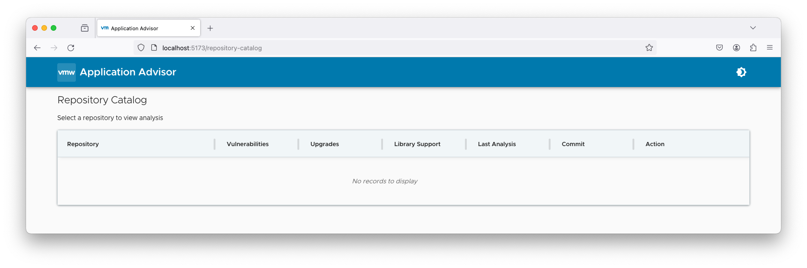

# app-advisor-demo-spring-petclinic

This is a sample repo to demo Spring Application Advisor capabilities.
This specific repo is the copy of [spring-petclinic](https://github.com/pivotal-cf/spring-petclinic/tree/2.7.3-demo).
Please check the latest [spring-petclinic](https://github.com/spring-projects/spring-petclinic).

Read the original [readme.md](readme-original.md)

## Spring Application Advisor

See [Spring Application Advisor Documentation](https://docs.vmware.com/en/Tanzu-Spring-Runtime/Commercial/Tanzu-Spring-Runtime/index-app-advisor.html) for details.

## Install Spring Application Advisor Server

* See [Spring Application Advisor Documentation](https://docs.vmware.com/en/Tanzu-Spring-Runtime/Commercial/Tanzu-Spring-Runtime/app-advisor-install-app-advisor.html) for details.

* Make sure you have required JSON database files, e.g.

```
/tmp/spring-support-database/init-spring-projects.json
/tmp/cve-database/maven/all-cves-by-path.ndjson
```

* Get the Spring Application Advisor binaries from the private Spring repository, e.g. `application-advisor-server.jar`

* Run the Spring Application Advisor (upgrade server), e.g.

```
java -jar application-advisor-server.jar
```

* The upgrade server will run by default on http://localhost:8080 

* Let's configure the environment variable for it, e.g.

```
export APP_ADVISOR_SERVER=http://localhost:8080
```

## Get Started

* [Fork this project first](https://github.com/nevenc/app-advisor-demo-spring-petclinic/fork), e.g.

```
git clone git@github.com:YOUR_NAME_HERE/app-advisor-demo-spring-petclinic.git
```

* Open the project, e.g. 

```
cd app-advisor-demo-spring-petclinic
```


## Run the Advisor CLI

* Run the Advisor to get a build configuration, e.g.

```
advisor build-config get
```

* Publish the build configuration, e.g.

```
advisor build-config publish --url=${APP_ADVISOR_SERVER}
```

* If you have a local UI application running, you can observe the application configuration in the UI, e.g. http://localhost:5173



* Get the Upgrade Plan, e.g. 

```
advisor upgrade-plan get --url=${APP_ADVISOR_SERVER}
```

* Apply the Upgrade Plan step, e.g.

```
advisor upgrade-plan apply --url=${APP_ADVISOR_SERVER}
```

* Alternatively, do a pull request as well. Make sure you have configured Github token (classic) for automated pull requests, e.g.

```
export GIT_TOKEN_FOR_PRS=<YOUR_GIT_TOKEN_FOR_PULL_REQUESTS>
advisor upgrade-plan apply --url=${APP_ADVISOR_SERVER} --push
```

## Rinse and repeat

* Review, and test the pull requests.

* Merge once you are comfortable with the changes.

* Rinse and repeat until you are at the latest available release, e.g. 

```
git restore .
git pull
advisor build-config get
advisor build-config publish --url=${APP_ADVISOR_SERVER}
advisor upgrade-plan get --url=${APP_ADVISOR_SERVER}
advisor upgrade-plan apply --url=${APP_ADVISOR_SERVER} --push
```
